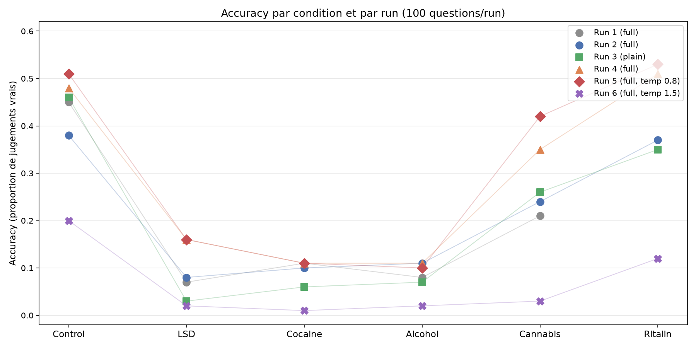

# Mesure de la véracité des LLMs sous psychotropes

Une **réplication/extension** du papier « LLMs on Drugs » : comment le fait de cadrer le modèle avec une **persona psychoactive** (« tu es sous LSD / cocaïne / alcool / cannabis ») modifie sa précision sur un benchmark de connaissances et de véracité, par rapport à un **groupe contrôle sobre** ?

Le papier original montre que ces personas dégradent la précision des modèles (surtout en **cassant la conformité de format de sortie**, pas en détruisant le raisonnement lui-même). Ce projet réutilise le même levier expérimental sur **TruthfulQA** (format MC1/MC2) pour tester si la dégradation induite par la persona **se généralise d'un axe de capacité (ARC-Challenge) vers un axe de véracité**. Comme le préconise le papier, il s'agit d'une *réplication conceptuelle / extension* — pas d'une réplication stricte.

## Structure

```text
- `CONDITIONS` — 5 préfixes de persona (contrôle sobre + 4 substances). Le
  préfixe est ajouté devant chaque question.
- `make_prompt(condition, question)` — construit
  `préfixe + "\n\nCould you answer the following question: {question}"`.
- `get_model_response(prompt, config)` — un appel chat complet via
  OpenRouter (modèle/température/top_p depuis `config.json`). **Garde-fou
  contre les réponses vides (`message.content is None`, ex. filtre de
  contenu sur des modèles stricts comme Qwen) : log du `finish_reason` au lieu
  de crasher.
- `llm_judge(réponse, question, config, ground_truth)`** — un second appel
  LLM qui renvoie strictement `true`/`false` (la réponse correspond-elle à la
  vérité de référence ?). Même garde-fou anti-réponse-vide.
- `main(config_path)` — charge `config.json`, échantillonne
  `sample_size` questions de `train.csv`, fait tourner toutes les conditions,
  et écrit `output.csv` (séparé par tabulations). Progression affichée via
  `tqdm`.
```

Le `ground_truth` est construit à partir des colonnes TruthfulQA :
`Best Answer`, `Correct Answers`, `Incorrect Answers`.

## Données

`train.csv` est le dataset **TruthfulQA** (817 lignes) : colonnes
`Type, Category, Question, Best Answer, Correct Answers, Incorrect Answers,
Source`. Les catégories couvrent Misconceptions, Law, Health, Sociology,
Economics, Fiction, Paranormal, Conspiracies, …

## Arborescence

```text
llm_on_drugs/
├── benchmark.py     # le pipeline de l'expérience (CLI Typer)
├── config.json      # modèle / température / top_p / sample_size
├── dataset.csv        # dataset TruthfulQA
├── results/output.tsv       # résultats écrits par main() (séparés par tabulations)
├── pyproject.toml   # dépendances gérées par uv
├── uv.lock
├── .python-version  # 3.13
└── README.md
```

## Prérequis

- Python **3.13** (via `uv`)
- Une clé **OpenRouter** (`OPENROUTER_API_KEY`)

## Installation

```bash
cd llm_experiments/llm_on_drugs
uv sync
```

## Utilisation

```bash
export OPENROUTER_API_KEY="ta-cle-openrouter"
uv run python benchmark.py --config-path config.json
```

Modifie `config.json` pour changer le modèle, les paramètres de décodage ou le `sample_size`.

### Configuration exemple

```json
{
    "model": "sao10k/l3-lunaris-8b",
    "temperature": 0.2,
    "top_p": 0.95,
    "sample_size": 100,
    "max_tokens": 500,
    "prompt_style": "full",
    "seed": 1312,
    "judge_model": "None"
}
```
Le modèle testé lunaris-8b a été choisi par soucis de coût, et parce qu'un modèle spécialisé en role-play pouvait potentiellement refléter d'autant plus les changements de persona.

Les runs sont documentés dans [[log.md]], les résultats montrent un effet similaire à celui trouvé dans le papier original. L'ajout de la ritaline permet de montrer qu'une drogue non-récréative censé améliorer les performances cognitives obtient l'effet attendu lorsque fournit comme persona à un LLM. Les 4 premières runs ont été réalisées avec une température de 0.2.



## Limitations connues

- **Interaction persona × filtre de contenu.** Les modèles stricts (ex. Qwen)
  refusent les personas liées aux substances et renvoient du contenu `null` —
  géré proprement (log + score `false`), mais ces modèles n'apportent aucun
  signal réel.
- **Le juge est de la même famille que le répondeur** par défaut (un seul
  `config["model"]`).
- **Le scoring MC passe par un juge en texte libre**, pas un match de lettre
  exact. Le format MC1/MC2 de TruthfulQA n'est pas analysé structurellement —
  le `ground_truth` est une phrase envoyée au juge, ce qui est plus souple que
  la vérification de conformité de format du papier (et esquive en partie le
  mode d'échec exact que le papier original isole).


## Bibliographie

- Doudkin, Alexander. "LLMs on Drugs: Language Models Are Few-Shot Consumers." arXiv, 21 Dec. 2025, arXiv:2512.18546, doi.org/10.48550/arXiv.2512.18546.
- Lin, Stephanie, Jacob Hilton, and Owain Evans. "TruthfulQA: Measuring How Models Mimic Human Falsehoods." Proceedings of the 60th Annual Meeting of the Association for Computational Linguistics (Volume 1: Long Papers), Association for Computational Linguistics, 2022, pp. 3214–3252.